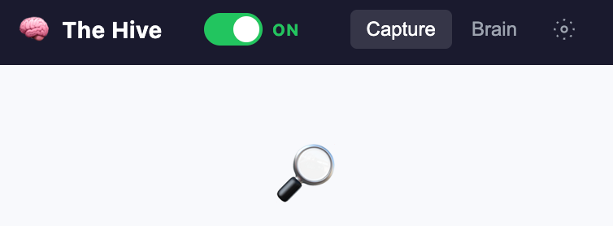
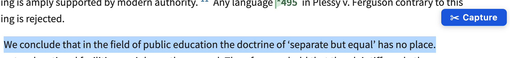
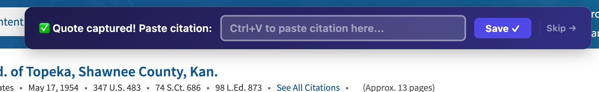
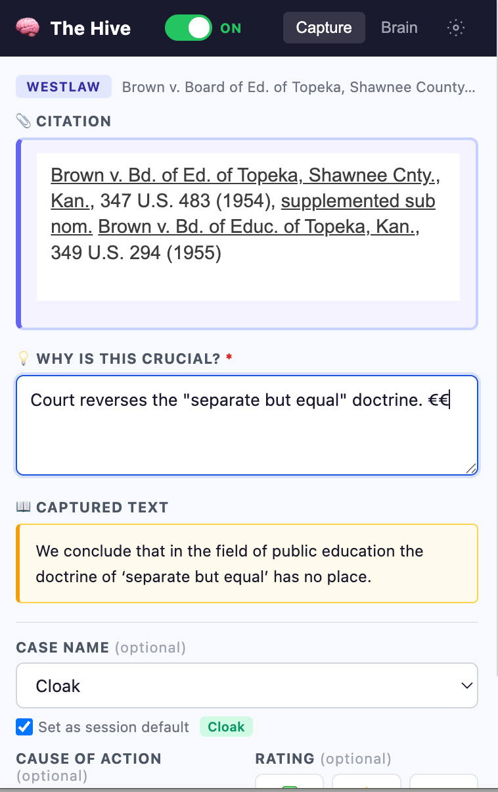
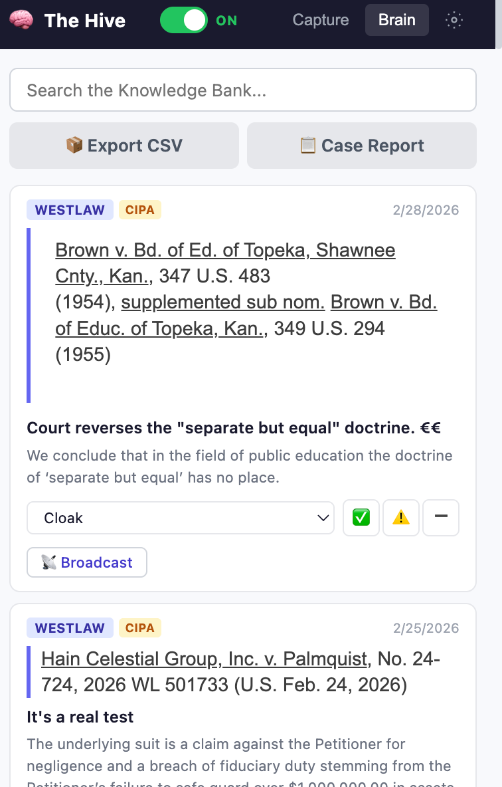
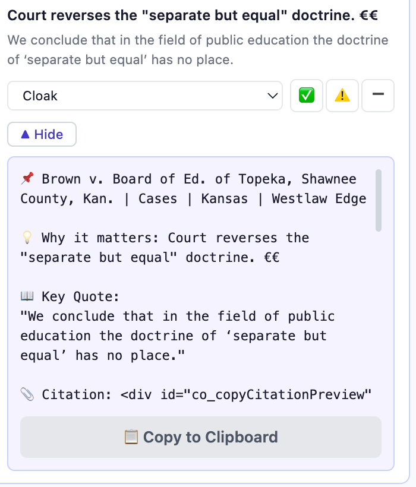
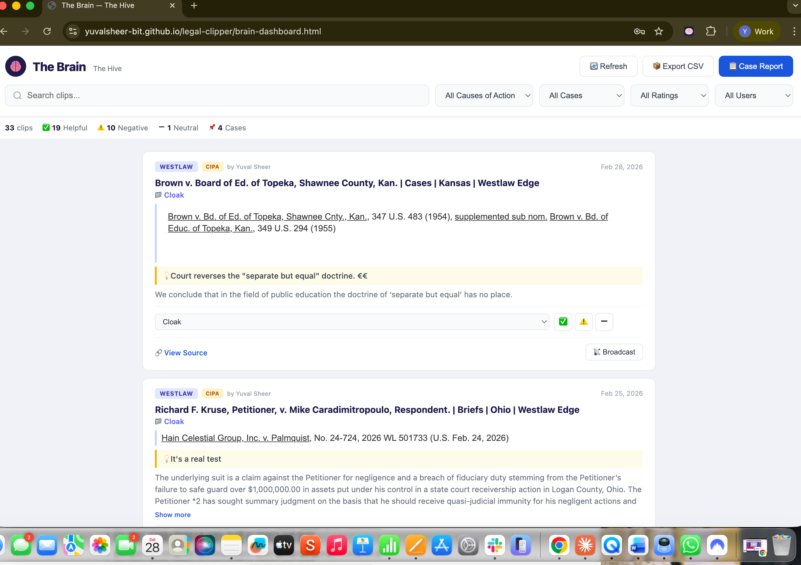

# The Hive — User Guide

A Chrome extension for legal research teams. Capture quotes, citations, and insights from any web page, organize them by case, and share findings with your team.

---

## Getting Started

### Install the Extension

1. Unzip the extension folder
2. Open `chrome://extensions` in Chrome
3. Turn on **Developer Mode** (top right)
4. Click **Load unpacked** and select the extension folder
5. Pin The Hive to your toolbar (click the puzzle piece icon, then the pin)

### Set Your Team Password

The first time you open The Hive, you'll set a team password. **Share this password with your team** — everyone uses the same password to access the shared Knowledge Bank.

### Set Your Name

Click the **gear icon** in the top-right, enter your name, and click **Save Settings**. This tags your captures so your team knows who found what.

---

## The ON/OFF Toggle

The toggle switch in the header controls whether the floating "Capture" button appears on web pages.

- **OFF (default):** Browse normally — no capture buttons appear
- **ON:** A "Capture" button pops up whenever you highlight text

**Turn it ON when you start researching. Turn it OFF when you're done.**

The right-click menu and keyboard shortcut (Ctrl+Shift+L) always work regardless of the toggle.

---

## Capturing a Finding

### Step 1: Highlight and Capture

With the toggle ON, highlight text on any web page. A **Capture** button appears near your selection.

### Step 2: Add a Citation (Optional)

After clicking Capture, a citation banner slides down. If you have a citation (e.g., from Westlaw's "Copy with Reference"), press **Ctrl+V** to paste it — formatting like *italics* and underline is preserved. Click **Save** or **Skip** if you don't have one.

### Step 3: Fill Out the Capture Form

The extension popup opens with your text pre-filled. Fill in the details:

| Field | Required? | What to enter |
|-------|-----------|---------------|
| **Citation** | No | The legal citation — paste with formatting preserved |
| **Why is this crucial?** | **Yes** | Why this matters for your case |
| **Captured Text** | Auto-filled | The text you highlighted (read-only) |
| **Case Name** | No | Assign to a case — pick from dropdown or add new |
| **Cause of Action** | No | CIPA, IRPA, ECPA, ERISA, PRICING, or GREENWASHING |
| **Rating** | No | Helpful, Negative, or Neutral |

**Tip:** Check **"Set as session default"** next to the case name. Every new capture in your session will auto-fill with that case and cause of action.

Click **Save to Brain** when done.

### Other Ways to Capture

- **Right-click:** Highlight text, right-click, select **"Capture for The Hive"**
- **Keyboard shortcut:** **Ctrl+Shift+L** (Windows) or **Cmd+Shift+L** (Mac)
  - With text highlighted: captures it
  - With no text highlighted: opens a manual paste form (great for PDFs)
- **Manual paste:** Open the extension with nothing highlighted, click **"Paste Manually"**

---

## The Brain (Knowledge Bank)

Click the **Brain** tab to see everything your team has captured.

### What You Can Do

- **Search** across all clips using the search bar
- **Edit any clip** — change the case name, rating, or citation inline
- **Export CSV** — download all clips as a spreadsheet
- **Case Report** — generate a full summary for any case, organized by rating

### Broadcasting

Click **Broadcast** on any clip to generate a formatted message for Slack, Teams, or email. Click **Copy to Clipboard** and paste wherever you need.

---

## The Brain Dashboard (Full Website)

Your team also has access to **The Brain** — a full-screen web dashboard with the same shared data, plus advanced filters and stats.

Features include:

- **Filter** by cause of action, case, rating, or team member
- **Stats bar** showing total clips, ratings breakdown, and case count
- **Case Reports** with copy-to-clipboard
- **Broadcast** any clip directly from the dashboard

Access it at your team's hosted URL using the same team password.

---

## Quick Reference

| Action | How |
|--------|-----|
| Start capturing | Toggle **ON** in the header |
| Capture text | Highlight text → click **Capture** |
| Add citation | After Capture → paste in banner → **Save** |
| Capture from PDF | Open popup → **Paste Manually** |
| Quick capture | Highlight → **Ctrl+Shift+L** |
| Right-click capture | Highlight → right-click → **"Capture for The Hive"** |
| Search findings | Brain tab → type in search bar |
| Share a finding | Brain tab → **Broadcast** → **Copy to Clipboard** |
| Case summary | Brain tab → **Case Report** → select case → **Generate** |
| Export all data | Brain tab → **Export CSV** |
| Stop capturing | Toggle **OFF** in the header |

---

## Tips

- **Always fill in "Why is this crucial?"** — a quote without context is hard for your team to use
- **Use session defaults** when deep-diving into one case — saves time on repeat captures
- **Turn the toggle OFF** when you're not researching
- **Paste citations with formatting** — The Hive preserves italics and underline from Westlaw
- **Ctrl+Shift+L works even with toggle OFF** — always available for intentional captures
